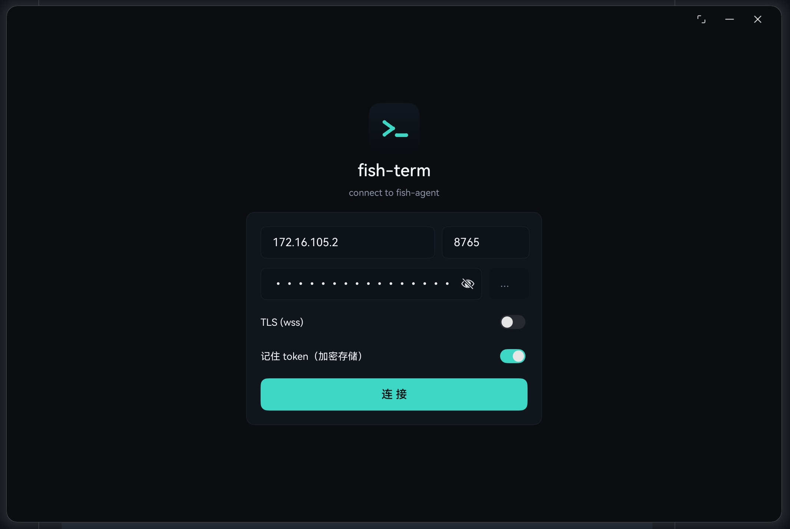
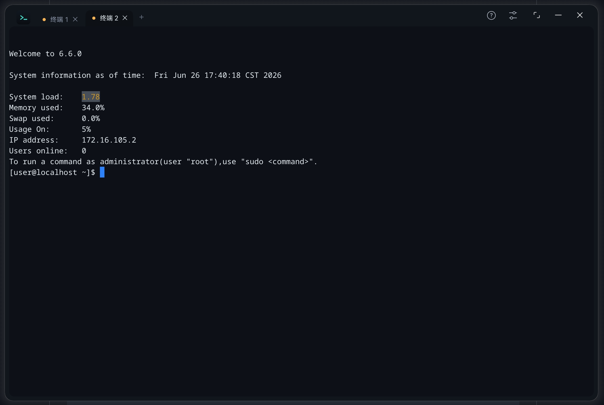
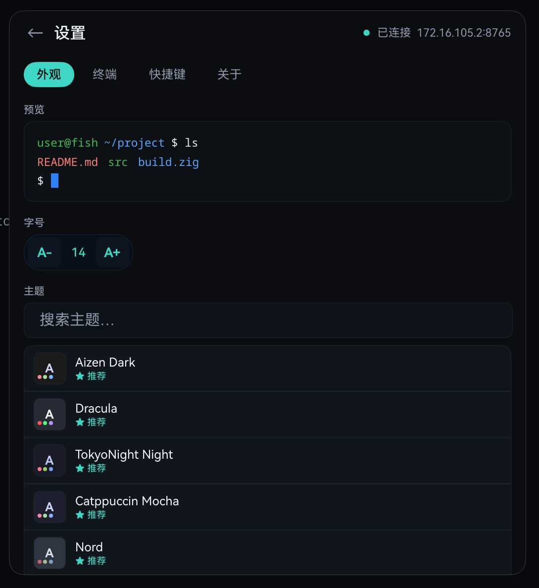
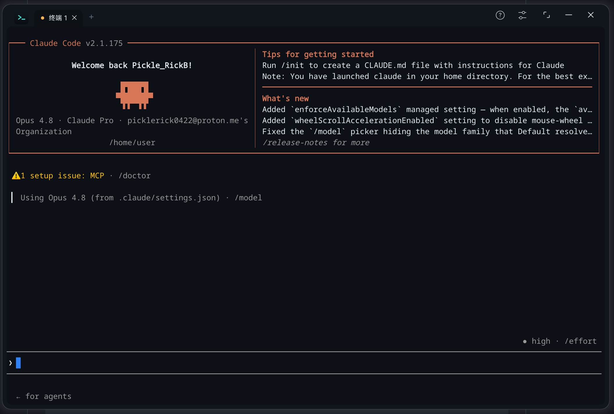

# fish-term

fish-term 是一个面向 HarmonyOS PC / 2in1 设备的终端应用。它使用 Ghostty 的 VT 终端核心负责转义序列解析与终端状态，用 HarmonyOS `XComponent` + Native Drawing 自绘终端画面，并通过 WebSocket 连接远端 `fish-agent` 后端来运行 shell。

这个仓库同时包含两部分：

- `libghostty_ohos`：可复用的 HarmonyOS HAR 终端库，发布名为 `libghostty-ohos`。
- `entry`：fish-term 应用本体，负责连接 UI、多标签、设置、持久化、WebSocket 传输和后台保活。

> 当前应用主线是 `fish-agent` WebSocket 远程终端。本地 PTY 和 SSH 的 native 代码仍在仓库中保留，但入口 UI 暂未把它们作为主要连接方式接入。

## 功能特性

- 基于 `libghostty-vt` 的 VT 终端解析与状态管理。
- HarmonyOS 原生 `XComponent` 终端表面，Native Drawing 自绘渲染。
- 面向 PC 的多标签终端界面，支持标签切换、关闭和拖拽排序。
- WebSocket 连接 `fish-agent`，支持输入、输出、resize、心跳和自动重连。
- UTF-8 streaming 解码，处理二进制 WebSocket 帧中的跨帧多字节字符。
- 外接键盘、鼠标、触摸、IME、剪贴板、右键菜单、选择、搜索。
- 主题选择，内置大量 Ghostty 格式主题。
- 字号、光标样式、光标闪烁、scrollback 行数设置。
- host / port / TLS / token 配置持久化，token 使用 HarmonyOS Asset Store Kit 加密存储。
- 后台 `DATA_TRANSFER` 保活，降低应用切后台时 WebSocket 被挂起导致远端 PTY 退出的概率。
- 内置 Symbols Nerd Font Mono 作为符号字形 fallback。

## 当前架构

```text
fish-term/
├── libghostty_ohos/                 # 可复用 HAR：终端组件、控制器、native 渲染与 VT 封装
│   ├── src/main/ets/
│   │   ├── TerminalSurface.ets       # ArkTS XComponent 终端表面
│   │   ├── TerminalController.ets    # 终端控制器：输入、输出、配置、主题、搜索、选择等
│   │   └── TerminalTypes.ets         # 公开类型与默认配置
│   ├── src/main/cpp/
│   │   ├── napi_init.cpp             # N-API / XComponent / 键鼠 / IME 桥接
│   │   ├── terminal/                 # Ghostty VT 包装与终端状态转换
│   │   └── renderer/                 # Native Drawing renderer
│   ├── prebuilt/arm64-v8a/           # libghostty_vt.a 预构建产物
│   └── src/main/resources/rawfile/   # 主题与字体资源
├── entry/                            # fish-term 应用
│   ├── src/main/ets/pages/
│   │   ├── Index.ets                 # 主界面：表单、多标签、终端、引导
│   │   └── SettingsPanel.ets         # 设置面板：主题、字号、光标、快捷键、关于
│   ├── src/main/ets/session/         # TerminalRuntime / TerminalSession
│   ├── src/main/ets/transport/       # WebSocket driver、URL、UTF-8 framer、backoff
│   ├── src/main/ets/store/           # 连接配置、token、终端偏好持久化
│   └── src/main/cpp/                 # 保留的本地 PTY / SSH native driver
├── tools/                            # 构建 Ghostty VT、fish HNP、设备验证辅助脚本
├── docs/                             # 调查记录、设计文档和阶段计划
├── BUILD.md                          # DevEco 构建说明
├── THIRD_PARTY_NOTICES.md            # 第三方组件说明
└── LICENSE
```

## 运行方式

fish-term 需要连接一个兼容的 `fish-agent` WebSocket 后端。应用会按如下形式构造连接地址：

```text
ws://<host>:<port>/ws?token=<token>&cols=<cols>&rows=<rows>
```

开启 TLS 时使用 `wss://`。

应用侧流程：

1. 启动 fish-term。
2. 在连接表单输入 `host`、`port`、`token`。
3. 按需开启 `TLS (wss)` 和“记住 token”。
4. 点击连接，应用会创建一个新终端标签页。
5. 新建标签页会复用当前连接配置，打开独立 WebSocket 会话。

连接断开后，WebSocket driver 会进入重连流程。需要注意：如果后端在 WebSocket 断开时销毁 PTY，那么重连会得到一个新的 shell，而不是续接原 shell。

## libghostty-ohos 用法

`libghostty_ohos` 是仓库内的本地模块；发布到 OHPM 时包名为 `libghostty-ohos`。

在本仓库开发时，`entry/oh-package.json5` 使用本地依赖：

```json5
{
  "dependencies": {
    "libghostty_ohos": "file:../libghostty_ohos"
  }
}
```

外部应用使用发布包时可安装：

```sh
ohpm install libghostty-ohos
```

基本用法：

```ts
import { TerminalController, TerminalSurface } from 'libghostty-ohos';

@Entry
@Component
struct TerminalPage {
  private controller: TerminalController = new TerminalController();

  aboutToAppear(): void {
    this.controller.setTheme('Aizen_Dark');
    this.controller.updateConfig({
      fontSize: 16,
      scrollbackLines: 20000,
      cursorStyle: 0,
      cursorBlink: true
    });

    this.controller.setInputListener((data: string) => {
      // 发送到你的 PTY / SSH / WebSocket driver
      this.driver.write(data);
    });
  }

  build() {
    Stack() {
      TerminalSurface({
        controller: this.controller,
        surfaceId: 'main-terminal-surface',
        surfaceColor: '#0B0D10'
      })
    }
    .width('100%')
    .height('100%')
    .backgroundColor('#0B0D10')
  }
}
```

使用约定：

- 每个终端实例使用一个独立的 `TerminalController`。
- 同时可见的多个 `TerminalSurface` 必须使用不同的 `surfaceId`。
- `TerminalSurface` 负责 native bind / unbind 生命周期，业务代码不要直接调用 `bindNative()` / `unbindNative()`。
- `getThemeList()`、`getThemeColors()`、`isRendererReady()` 等依赖 native 的方法，需要 surface attach 后才有意义。

## 传输层

应用内使用 `TerminalDriver` 把终端渲染和 I/O 传输解耦：

```ts
interface TerminalDriver {
  start(cols: number, rows: number): void;
  write(data: string): void;
  resize(cols: number, rows: number): void;
  stop(): void;
  onOutput(cb: (data: string) => void): void;
  onStatus(cb: (s: DriverStatus) => void): void;
}
```

当前实现状态：

| 传输 | 状态 | 说明 |
| --- | --- | --- |
| `FishWebSocketDriver` | 主线可用 | 连接 `fish-agent`，支持 binary I/O、JSON 控制帧、心跳和 backoff 重连 |
| 本地 PTY native | 代码保留 | `entry/src/main/cpp/pty/` 和 `ExampleShellDriver.ets` 仍在，当前 UI 主线未接入 |
| SSH native | 可选编译/代码保留 | 默认使用 stub；启用需准备 `libssh2` / `mbedtls` 并设置 `-DWAND_ENABLE_SSH=ON` |

## 构建

完整构建说明见 [BUILD.md](BUILD.md)。简要步骤如下。

安装 OHPM 依赖：

```sh
ohpm install
```

如需重新生成 Ghostty VT 静态库：

```sh
./tools/build-ghostty-vt-docker.sh
```

该脚本会生成：

```text
libghostty_ohos/prebuilt/arm64-v8a/libghostty_vt.a
```

使用 DevEco Studio / hvigor 构建应用：

```sh
/Applications/DevEco-Studio.app/Contents/tools/hvigor/hvigor/bin/hvigor.js assembleApp -m project --no-daemon
```

目标环境：

| 项目 | 要求 |
| --- | --- |
| HarmonyOS | 6.0.0 / API 20 |
| ABI | `arm64-v8a` |
| IDE | DevEco Studio |
| Native 工具链 | HarmonyOS NDK、CMake |
| Ghostty VT 重建 | Docker + Zig |

说明：

- 当前 `libghostty_vt.a` 只提供 `arm64-v8a`。
- 真机/arm64 设备是主要验证环境。
- 打包运行需要本地签名配置；仓库里的签名配置可能与个人 DevEco 环境相关。

## 本地验证

仓库中有少量纯逻辑 Node 测试，覆盖字号、backoff、WebSocket URL 和 UTF-8 framing：

```sh
node --test tools/verify/
```

HarmonyOS UI 和 native 渲染问题需要在 DevEco + 设备上验证。

## 近期重要问题记录

- [首字符不显示 Bug 调查与修复](docs/首字符不显示-调查与修复.md)：记录了外接键盘输入时首字符空白的问题。最终根因是 OH_Drawing typography run 右边界裁剪，修复方式是逐 cell 绘制并给 glyph layout 留 overhang。

## 截图

### 未连接状态首页



### 多标签终端



### 主题设置



### Claude Code 运行界面



## 第三方组件

| 组件 | 用途 | 许可 |
| --- | --- | --- |
| Ghostty / `libghostty-vt` | VT 终端核心 | MIT |
| simdutf | Ghostty 构建依赖 | Apache-2.0 OR MIT |
| Google Highway | Ghostty 构建依赖 | Apache-2.0 OR BSD-3-Clause |
| Symbols Nerd Font Mono | 符号字形 fallback | 见字体元数据 |

详细说明见 [THIRD_PARTY_NOTICES.md](THIRD_PARTY_NOTICES.md)。

## License

MIT，见 [LICENSE](LICENSE)。
